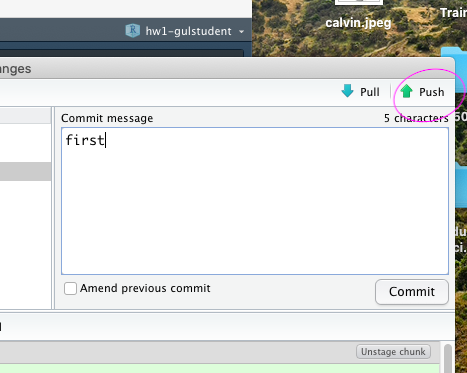

We will be using `git` and `GitHub` to get send your individual-based and team-based studies and get them back. In this short tutorial, we will show you the process using `git` and `GitHub` through `RStudio`. For that reason you have to install `git` (the one most suitable for your operating system), introduce your `GitHub` account to your local `git`, and make sure `RStudio` can talk to local `git` (and, therefore, `GitHub`). If you need assistance, I strongly suggest you to take a look at the following great sources:


                            https://happygitwithr.com/ and
                            
                            https://ourcodingclub.github.io/tutorials/git/.


We will create all individual-based and team-based assignments in `GitHub` classroom of `MAT381E-Fall21` organization. 

```{r echo=FALSE, results='asis', out.width='100%'}
knitr::include_graphics('images/organization.png')
```
Afterwards, we will send out you the assignment invitation links to you via Ninova announcements so that you can join the assignment (you have to accept the invitation to see the assignment repo under `MAT381E-Fall21` organization). Once you accept the invitation, you will see that **you have a repository under `MAT381E-Fall21` organization for the relevant assignment**. For example `<HW1-yourusername` for Homework 1. Please see my fake student repo for HW 1.

```{r echo=FALSE, results='asis', out.width='100%', fig.cap=''}
knitr::include_graphics('images/github_gulstudent2.png')
```

Throughout the semester you will be an **outside collaborator** of `MAT381E-Fall21` organization on GitHub, not a member. This means that you can only see your repository under `MAT381E-Fall21` organization, whereas I can see all the repositories.

In the "repository URL", copy the SSH URL of the assignment as shown below (in my fake account, i did not take SSH key, but you should do, otherwise you cannot commit and push your work from R Studio to GitHub) :


```{r echo=FALSE, results='asis', out.width='100%'}

```

Then, in RStudio, start a new project:

`File > New Project > Version Control > Git `

```{r echo=FALSE, results='asis', out.width='100%'}

```

Paste the URL of the assignment as shown below:

```{r echo=FALSE, results='asis', out.width='100%'}

```

Click "Create Project". You should now see the files in the repository in the lower right window in RStudio. Also notice that Git tab appears at the top right window in RStudio. 

```{r echo=FALSE, results='asis', out.width='100%'}

```

Now, you have a local copy of your assignment. Work on it. Do whatever you need. You can use Git tab to `commit` and `push`. 

```{r echo=FALSE, results='asis', out.width='100%'}



```
  
  
Check back your repository on GitHub!..Always send your assignments on time!..(In the terminal window, use git commands `commit` and `push` to send the changes you have done to your local repository to GitHub.)


Wish you a productive semester!..

```{r echo=FALSE, results='asis', out.width='100%', fig.cap=''}

```


